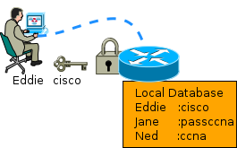

# Authentication Authorization Accounting


Cisco place a very heavy emphasis on external security, or offline solutions such as TACACS or RADIUS. In this section we will learn how to make things at least harder for unauthorized users to access the network with our intention being protecting our sensitive network equipment and services.

So what is the **Cisco AAA** architecture?
Well we can break it down very easily by using three simple definitions:

1. **Authtenitcaion** - This establishes who you say you are.
2. **Authorization** - This defines what you can do.
3. **Accounting** - Now we know who you are, this establishes what you did.

**So why bother with this in the first place?**

I have two good reasons, for one thing it's very likely you will need to provide remote access to your network at some point, plus AAA is a great addtion to support **IPsec** and **SSL VPN** access. The other good reason is that administrators can verify who they say they are when accessing a router or switch via **Telnet** (don't use it!!!), or **SSH** (better right?).

## Authentication

Ok let's now look at how we can implement some of these things on a Cisco router, and as I said before Cisco places more emphasis on the configuration of external AAA but before we do that I should mention **self-contained AAA**. This is essentialy a local authentication on the router using a local `username/password` database. Let's just get right to it and see how this is done on say, a router. Bear in mind that in Figure 1.1 I am using a console connection to initially configure the router. 

**Important Point!**

Do not come off the router while configuring this, if you decide to go and get a `cafe latte` halfway through, the router will lock you out unless of course you have set _exec-timeout_ to zero or something on your line console or vty line. It's safer to just make sure you complete the three steps below first (Listing 1.1), then grab that latte, come back and let yourself in. (Providing you don't forget the password you set). 
Failing to do so will require a password recovery process.



```
R1(config)# aaa new-model
R1(config)# username Eddie password cisco
R1(config)# aaa authentication login default local
```
**What did we just do?**

***Global***

First of all, the `aaa new-model` command is a critical first step in establishing **AAA** user authentication and starts the global process for **AAA** on the router. 

***Local***

Next a local `username/password` database is used to provide access to a small group of users by using the `username` _Eddie_ `password` _cisco_. Bear in mind the `username secret` command may also be used to configure a username and its associated MD5-encrypted secret. 

***Default***

The last command we used is `aaa authentication login` and here we define the **default** method to be used when a user logs in, which can be any of the following:


